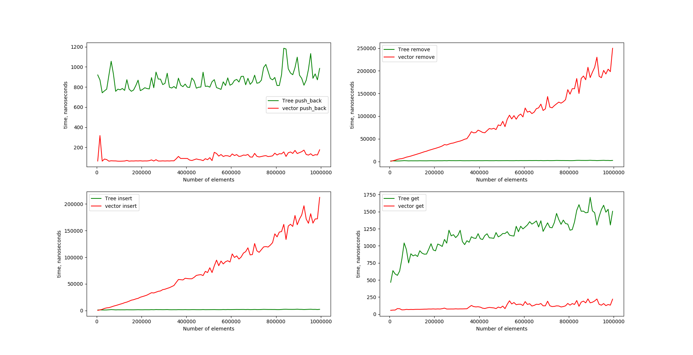

# data-structures

## description
List 
insertion, deletion, search takes Log(N) time

## inrernal structure

binary tree.  
each child knows how bigger it is, then its parent
root has its real index

#### tests
there are tests in main.cpp

speed tests create files, which can be parsed by speedgraph.py

here is performance comparison with std::vector

