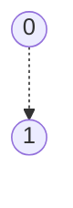
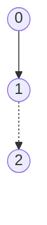
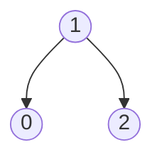
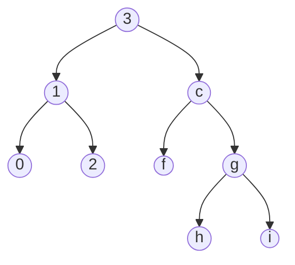

# data-structures

## description
List 
insertion, deletion, search takes Log(N) time

## inrernal structure

binary tree.  
each child knows how bigger it is, then its parent
root has its real index

### insertion

`insert(1)`

`insert(2)`

rotate

lets create more complicated example

